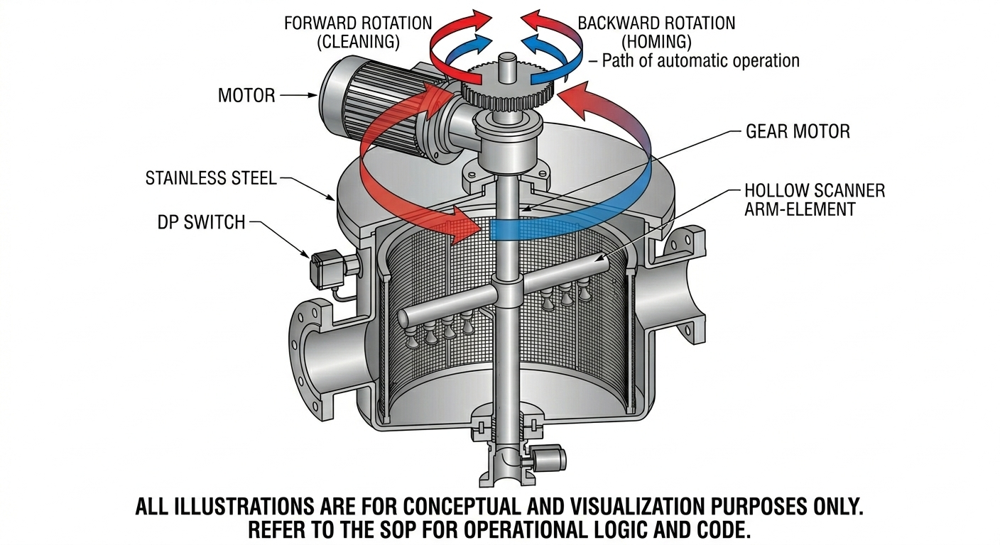

# 🌊 Industrial Auto Backwash Filter (ABF) - Master SOP
> **Project Division:** Fluid Handling & Filtration | **Author:** Syed Hilaluddin Madany
> **Standard:** MMF-2026-ABF-V1 | **Status:** [RELEASED]
---

## 🏗️ 1. System Anatomy


An ASCF is defined as a high-efficiency filtration system that maintains a constant flow rate by cleaning its own element while the process is still running. Unlike manual filters, it does not require a "Standby" unit because it never needs to be opened for cleaning.Core Operational Principles:The "Barrier" 

Principle: The liquid enters a cylindrical stainless steel Wedge Wire element. Solids are trapped on the inner surface.The "Sensing" Principle: The system remains in "Filtration Mode" until the debris layer causes the Differential Pressure ($DP$) to rise.The "Purge" Principle: Once the $DP$ threshold is reached ($0.5$ kg/cm²), the Scanner Motor and Drain Valve activate. The system uses a "Vacuum Effect" to pull a small amount of clean water backward through the mesh to flush the dirt out.


**Identify these core components before operation:**

<p align="center">

<em><b>Figure 1:</b> Conceptual view of the internal scanner and flow path.</em>
<sup style="color: gray;">

* **Filter Element:** Stainless steel wedge wire mesh.
* **DP Switch:** Sensor measuring pressure difference ($P_{in} - P_{out}$).
* **Backwash Arm:** Rotating hollow suction scanner.
* **Drain Valve:** Actuated valve open to the atmosphere.

---

## ⚙️ 2. Operational Logic (The Code)
The system uses this logic to automate the cleaning process.

```python
# --- PLC MOTOR & FLOW CONTROL ---
# 0 = Stopped, 1 = Forward (Cleaning), -1 = Reverse (Homing/Unclog)

def execute_backwash_cycle(current_dp):
    motor_status = 0
    drain_valve = "CLOSED"

    if current_dp >= 0.5:
        print("Initiating Cleaning Cycle...")
        drain_valve = "OPEN"
        
        # Phase 1: Forward Rotation (360 degrees)
        motor_status = 1 
        print("Scanner Arm: Rotating FORWARD")
        run_timer(40) # 40 seconds cleaning
        
        # Phase 2: Reverse Rotation (Optional for deep clean)
        motor_status = -1
        print("Scanner Arm: Rotating BACKWARD to Home Position")
        run_timer(20)
        
        # Shutdown
        motor_status = 0
        drain_valve = "CLOSED"
        print("Cycle Complete. System in Filtration Mode.")
```
---

## 🔄 3. Functional Step-by-Step Procedure


### Phase A: Normal Filtration Mode
* **Inflow:** Liquid enters from the **Inlet** and passes through the **Filter Element**.
* **Outflow:** Clean liquid exits through the **Outlet**.
* **Accumulation:** Contaminants collect on the internal surface, increasing pressure drop.

### Phase B: The Backwash Trigger
* **Detection:** When the **DP Switch** reaches **0.5 kg/cm²**, the PLC triggers the motor.
* **Rotation:** The Motor starts rotating the **Backwash Arm** at **10-15 RPM**.
* **Actuation:** The **Motorized Drain Valve** opens to the atmosphere.


### Phase C: The "Suck-Back" Physics
* **Vacuum Effect:** The atmospheric drop creates a powerful suction inside the hollow arm.
* **Reverse Flow:** Water is forced **backwards** from the clean side through the mesh.
* **Efficiency:** The system cleans itself in **40 seconds** with only **2-3%** water loss.

---

## 📊 4. Technical Performance Matrix

| Specification | Standard Value | Purpose |
| :--- | :--- | :--- |
| **Trigger DP** | 0.5 kg/cm² | Prevents element choking & deformation. |
| **Rotation Speed** | 10 - 15 RPM | Ensures complete 360° cleaning coverage. |
| **Water Recovery** | 98% Efficiency | Minimizes process waste and OPEX. |
| **Cycle Duration** | 40 Seconds | Rapid regeneration of media. |

---

## 🛠️ 5. Maintenance & Safety Checklist

- [ ] **Check DP Gauge:** Ensure it returns to **<0.1 kg/cm²** immediately after a cycle.
- [ ] **Manual Override:** Test the **Selector Switch** and **Push Button** weekly.
- [ ] **Manual Drain:** Use the bottom valve for evacuation during shutdowns.

> **⚠️ WARNING:** Never attempt to open the filter cover while the system is pressurized. Always verify zero pressure on the gauge before maintenance.
---

## 🧪 6. System Verification (Simulation)
Before deploying the logic to the PLC, use this Python script in **Google Colab** to simulate the filter's behavior. 


### 🐍 Execution Script
```python
import time
import random

# Simulated Filter Logic
def start_simulation():
    pressure = 0.1
    print("🚀 ABF Monitoring System Started...")
    
    while pressure < 0.7:
        pressure = round(pressure + 0.1, 2)
        print(f"Current DP: {pressure} kg/cm²")
        time.sleep(0.5)
        
        if pressure >= 0.5:
            print("\n🚨 TRIGGER: High Pressure Detected!")
            print("🔓 DRAIN: Valve Opening...")
            print("⏩ MOTOR: Rotating FORWARD (Cleaning)")
            time.sleep(2)
            print("⏪ MOTOR: Rotating BACKWARD (Homing)")
            time.sleep(1)
            print("🔒 DRAIN: Valve Closing.")
            print("✅ STATUS: Filter Cleaned.\n")
            break

start_simulation()

```
---
🛠️ How to Test:
Open Colab: Go to Google Colab.

Paste & Run: Copy the code block above into a cell and press Play.

Verify: Ensure the Forward and Backward motor actions trigger exactly at 0.5 kg/cm².
---
**© 2026 Syed Hilaluddin Madany | Global Solutions Hub**
